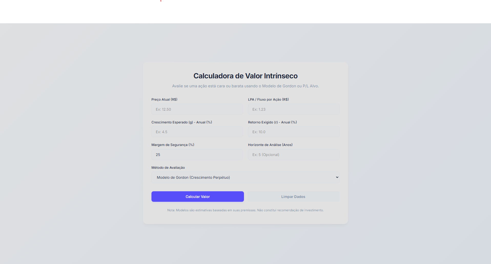

# Calculadora de Valor Intrínseco

## 🔗 Acesse o Projeto
[**Clique aqui para usar a calculadora**](https://levibarbosa.github.io/calculadoragordon)

---

## 📝 Sobre o Projeto
Esta é uma **Calculadora de Valor Intrínseco** moderna e intuitiva, desenvolvida para ajudar investidores a estimar o valor justo de ações utilizando modelos financeiros clássicos.

O projeto foi construído com foco em **educação financeira** e **design premium**, tornando conceitos complexos acessíveis a todos.

### 🚀 Funcionalidades
- **Modelo de Gordon (Crescimento Perpétuo)**: Ideal para empresas maduras que pagam dividendos constantes.
- **Modelo de P/L Alvo**: Estima o valor com base em múltiplos de preço sobre lucro.
- **Margem de Segurança**: Permite aplicar um desconto de segurança para minimizar riscos.
- **Projeção Futura**: Simula o valor intrínseco e o lucro por ação (LPA) para os próximos anos.
- **Feedback Visual**: Indica claramente se a ação está "Cara" ou "Barata" com base nos seus critérios.

## 🛠️ Tecnologias Utilizadas
- **HTML5**: Estrutura semântica e organizada.
- **CSS3**: Design moderno com Glassmorphism, variáveis CSS e layout responsivo (Mobile-First).
- **JavaScript (ES6+)**: Lógica de cálculo robusta e interativa.

## 📂 Estrutura do Código
O código foi separado para facilitar o estudo e manutenção:
- `index.html`: Estrutura da página.
- `style.css`: Estilos e design.
- `script.js`: Lógica e cálculos.

Cada arquivo contém **comentários detalhados** explicando o funcionamento de cada parte, ideal para quem está aprendendo programação web!

---

Desenvolvido com 💙 por Levi Barbosa.
